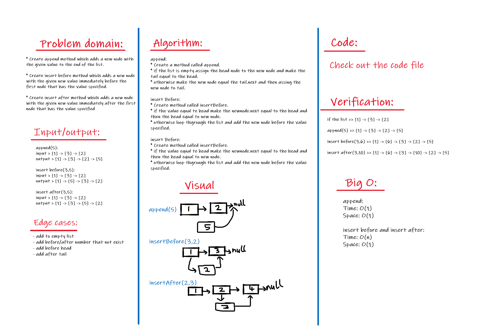
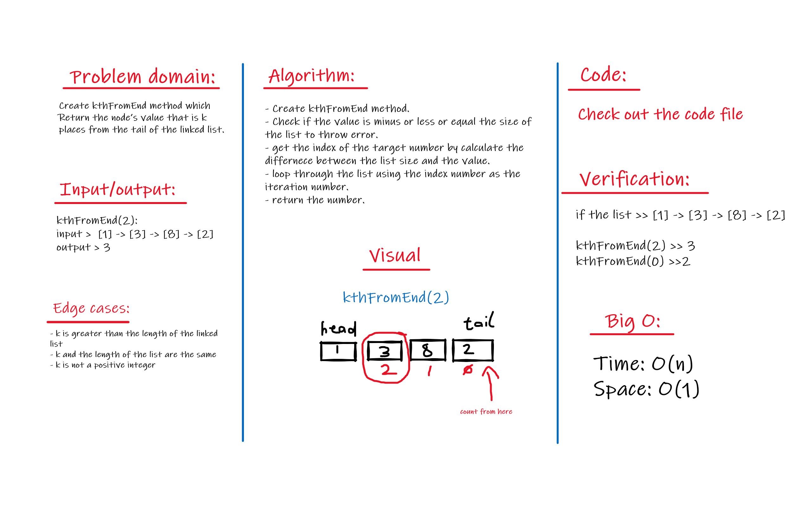

# Singly Linked Lists

Singly linked list data structure.

## Challenge

Create Node class and linked list class, and create (insert, include, to string, append, insert before, insert after, kthFromEnd) methods inside linked list class.

## Approach & Efficiency

### challenge 06:

- append

  - Time: O(1)
  - Space: O(1)

- insert before and insert after:

  - Time: O(n)
  - Space: O(1)

### challenge 07:

- Time: O(n)
- Space: O(1)

## API

### challenge 05:

- insert

  Adds a new node with that value to the head of the list.

- includes

  Indicates whether that value exists as a Node’s value somewhere within the list.

- to string

  Returns: a string representing all the values in the Linked List, formatted as:
  "{ a } -> {

### challenge 06:

- append

  adds a new node with the given value to the end of the list

- insert before

  adds a new node with the given new value immediately before the first node that has the value specified

- insert after

  adds a new node with the given new value immediately after the first node that has the value specified

### challenge 07:

- kth from end

  Return the node’s value that is k places from the tail of the linked list.

## Whiteboard Process

### Challenge 06

### Challenge 07

[Back to table of contenets](../README.md)
