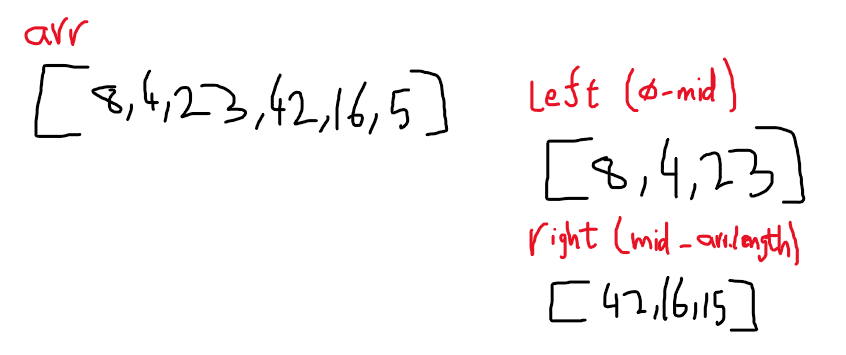
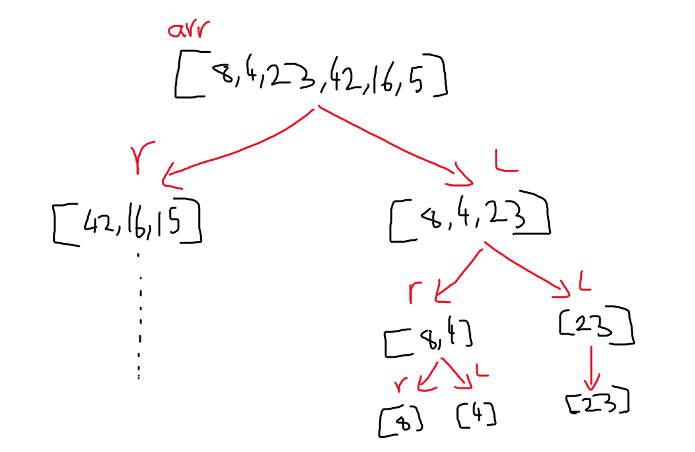
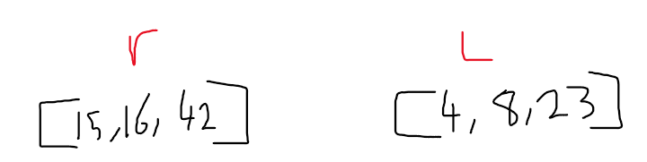
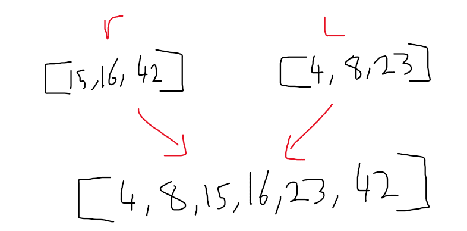

# Merge Sort

## Trace

> Sample Array: [8,4,23,42,16,15]

- pass 1:
  divide the original array into 2 arrays (left and right).

  

- pass 2:
  divide left array also to left and right, till we reach one element in each array, and so on for the right array

  

- pass 3:
  sort and merge the left side and the right side

  

- pass 4:
  sort and merge with the original array

  

## Efficency

- Time: O(2n) >> many loops at the same level
- Space: O(n) >> new arrays declared
