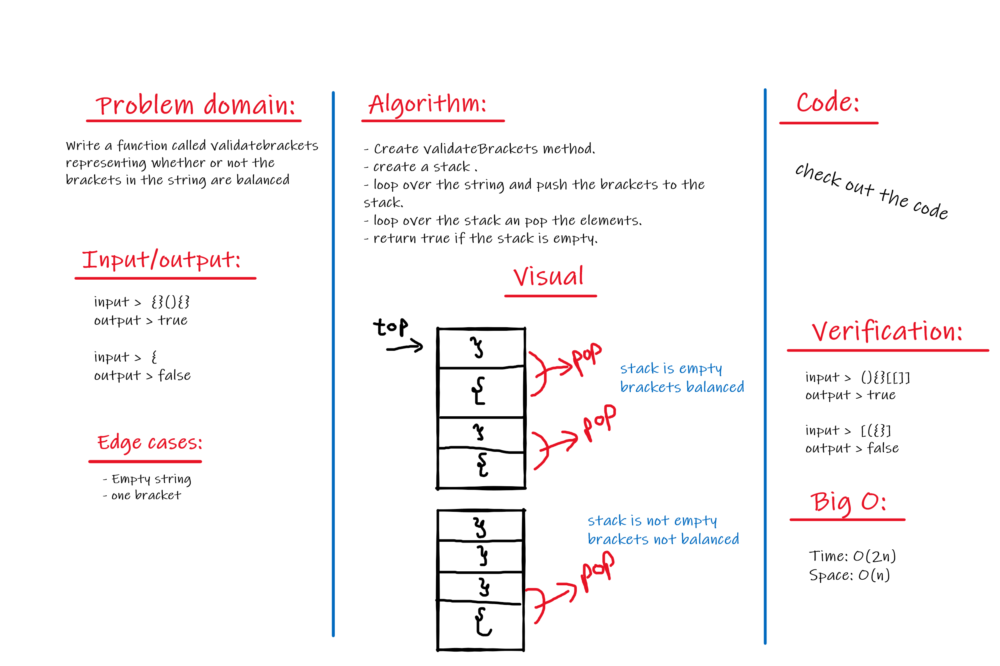

# Stacks and Queues

- A stack is a data structure that consists of Nodes. Each Node references the next Node in the stack, but does not reference its previous(1).

  - Common terminology for a stack is:(1)

    - Push - Nodes or items that are put into the stack are pushed
    - Pop - Nodes or items that are removed from the stack are popped.
    - Top - This is the top of the stack.
    - Peek - When you peek you will view the value of the top Node in the stack.
    - IsEmpty - returns true when stack is empty otherwise returns false.

  - Stacks follow these concepts:
    - FILO >> First In Last Out, means that the first item added in the stack will be the last item popped out of the stack.
    - LIFO >> Last In First Out, means that the last item added to the stack will be the first item popped out of the stack.

- Common terminology for a queue is:
  - Enqueue - Nodes or items that are added to the queue.
  - Dequeue - Nodes or items that are removed from the queue. If called when the queue is empty an exception will be raised.
  - Front - This is the front/first Node of the queue.
  - Rear - This is the rear/last Node of the queue.
  - Peek - When you peek you will view the value of the front Node in the queue. If called when the queue is empty an exception will be raised.
  - IsEmpty - returns true when queue is empty otherwise returns false.
  - Queues follow these concepts:
    - FIFO >> First In First Out, means that the first item in the queue will be the first item out of the queue.
    - LILO >> Last In Last Out, means that the last item in the queue will be the last item out of the queue.

## Challenge

- challenge 10 >> By Using a Linked List as the underlying data storage mechanism, implement both a Stack and a Queue data structure.

- challenge 11 >> Implement a Queue using two Stacks.

- challenge 12 >> Create a class called AnimalShelter which holds only dogs and cats. The shelter operates using a first-in, first-out approach.

- challenge 13 >> Create a function called validate brackets and return whether or not the brackets in the string are balanced.

## Approach & Efficiency

- challenge 10:

  - Time: O(1)
  - Space: O(1)

- challenge 11:

  - Time: O(n)
  - Space: O(1)

- challenge 12:

  - Time: O(n)
  - Space: O(1)

- challenge 13:

  - Time: O(2n)
  - Space: O(n)

## API

### challege 10:

- Stack > **push** > adds a new node with that value to the top of the stack with an O(1) Time performance.
- Stack > **pop** > Removes the node from the top of the stack and returns the value from node from the top of the stack
- Queue > **enqueue** > adds a new node with that value to the back of the queue with an O(1) Time performance.
- Queue > **dequeue** > Removes the node from the front of the queue and returns the value from node from the front of the queue.
- Stack and Queue > **peek** > Returns Value of the node located at the front(queue) and top(stack).
- Stack and Queue > **is empty** >Returns Boolean indicating whether or not the queue or stack is empty

### challege 11:

- **enqueue** > Inserts value into the PseudoQueue, using a first-in, first-out approach.
- **dequeue** > Extracts a value from the PseudoQueue, using a first-in, first-out approach

### challege 12:

- **enqueue** > Inserts dog or a cat object to the queue.
- **dequeue** > Accept "dog" or "cat" and return either a dog or a cat, based on preference. If pref is not "dog" or "cat" then return null.

### challege 13:

- **validateBrackets** > validate brackets and return whether or not the brackets in the string are balanced.

## WhiteBoards

- Challenge 13

[Back to table of contenets](../README.md)
